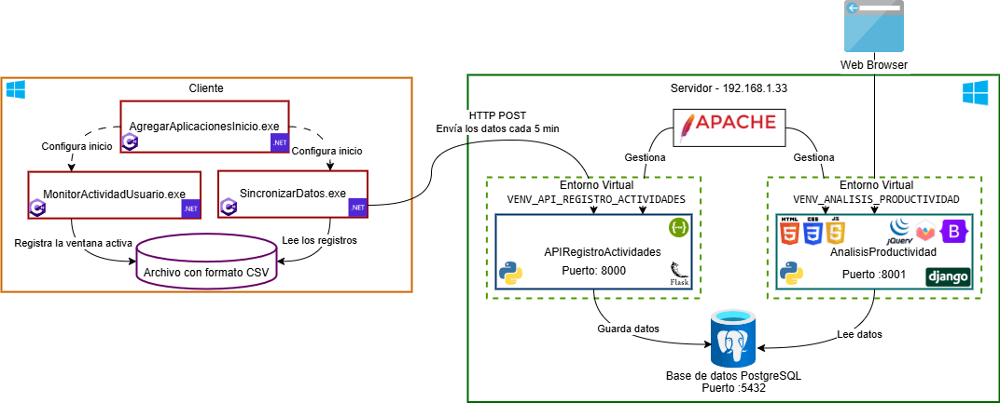
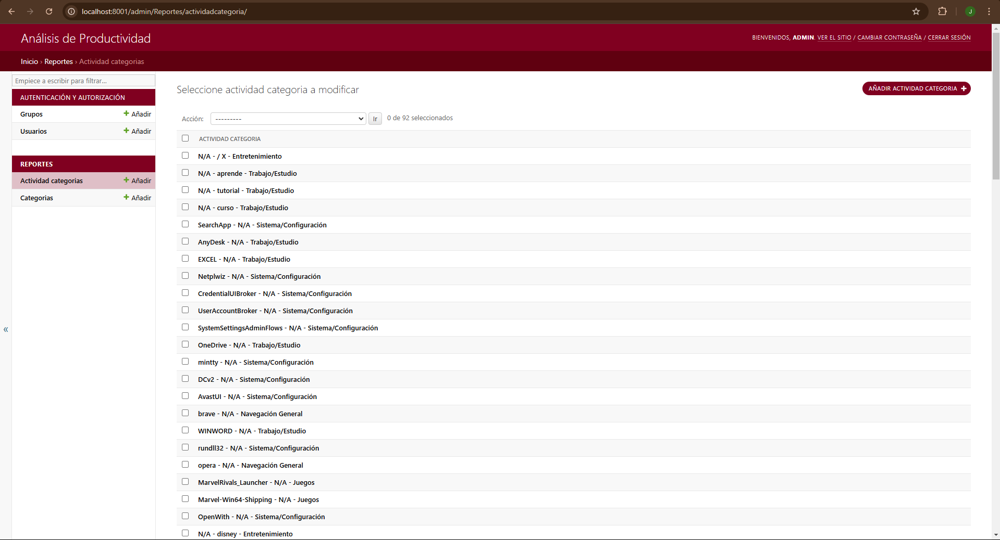
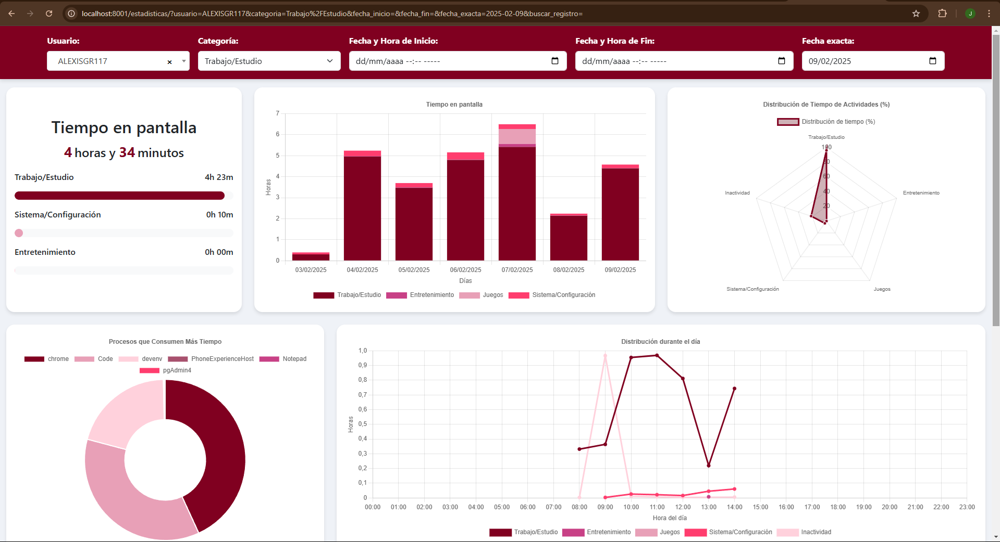
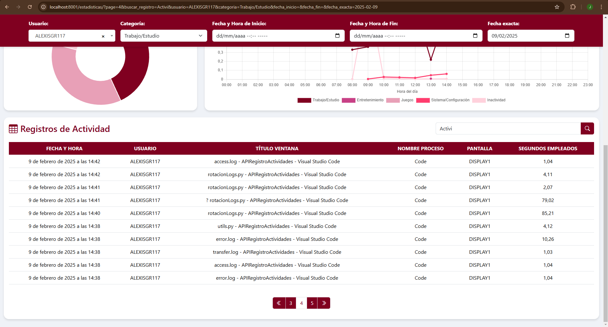
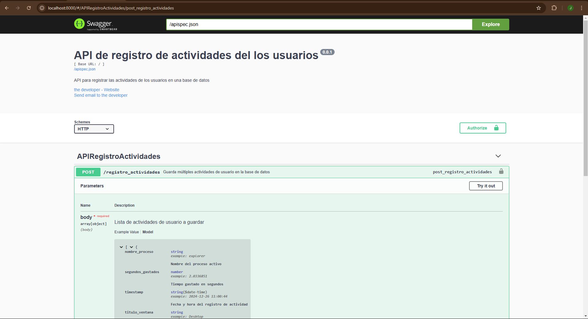
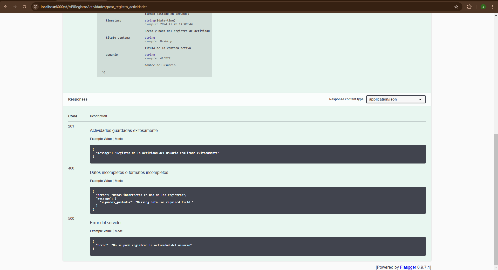

# Registro de Actividad Integral
Sistema integral para monitorear, almacenar y analizar la actividad del usuario en sistemas Windows en tiempo real.



## Tabla de Contenidos
- [Registro de Actividad Integral](#registro-de-actividad-integral)
  - [Tabla de Contenidos](#tabla-de-contenidos)
  - [Descripción del Proyecto](#descripción-del-proyecto)
  - [Características Clave](#características-clave)
  - [Componentes del Sistema](#componentes-del-sistema)
    - [MonitorActividadUsuario (C# .NET)](#monitoractividadusuario-c-net)
    - [SincronizadorDatos (C# .NET)](#sincronizadordatos-c-net)
    - [APIRegistroActividades (Python Flask)](#apiregistroactividades-python-flask)
    - [AnalisisProductividad (Python Django)](#analisisproductividad-python-django)
  - [Inicio Rápido](#inicio-rápido)
    - [Tecnologías Utilizadas](#tecnologías-utilizadas)
    - [Requisitos Previos](#requisitos-previos)
    - [Instalación](#instalación)
      - [1. Clona el respositorio](#1-clona-el-respositorio)
      - [2. Base de Datos PostgreSQL](#2-base-de-datos-postgresql)
      - [3. Configuración API Flask](#3-configuración-api-flask)
      - [4. Aplicación Django](#4-aplicación-django)
      - [5. Configuración de Aplicaciones Windows](#5-configuración-de-aplicaciones-windows)
      - [6. Configuración Apache](#6-configuración-apache)
      - [7. Gestión de Categorías y Clasificación](#7-gestión-de-categorías-y-clasificación)
        - [Panel de Administración de Django](#panel-de-administración-de-django)
        - [Personalización Avanzada](#personalización-avanzada)
  - [Uso](#uso)
  - [Documentación de la API](#documentación-de-la-api)

## Descripción del Proyecto
Sistema completo para el monitoreo continuo de actividad en equipos Windows, que incluye:
- 📊 Registro detallado de ventanas activas
- 🔄 Sincronización automática de datos
- 🗄️ Almacenamiento en base de datos PostgreSQL
- 📈 Panel de análisis con visualizaciones interactivas

## Características Clave
- ⏱️ Monitoreo en tiempo real
- 📈 Dashboard interactivo con Chart.js
- 🔄 Sincronización cada 5 minutos
- 📦 Configuración automática al inicio
- 🛠️ Clasificación personalizable de actividades
- 👥 Soporte multi-usuario

## Componentes del Sistema

El proyecto consta de cuatro componentes principales:

### MonitorActividadUsuario (C# .NET)
Aplicación de Windows que rastrea la ventana activa y la duración de uso.

- Registra ventanas activas cada segundo
- Guarda los registros en formato CSV

### SincronizadorDatos (C# .NET)

Servicio de sincronización que transmite registros locales al servidor central.

- Extrae la información del archivo CSV generado.
- Envía los datos a un endpoint mediante HTTP POST.

### APIRegistroActividades (Python Flask)

Servidor API basado en Flask para la ingesta y almacenamiento de datos.

- A través de un endpoint HTTP POST recibe la información sincronizada.
- Guarda los registros en una base de datos PostgreSQL.
- Incluye documentación interactiva con Swagger.

### AnalisisProductividad (Python Django)

Plataforma de análisis basada en Django con capacidades de visualización.

- Consulta y muestra la información almacenada en PostgreSQL.
- Utiliza Chart.js, Bootstrap y JQuery para generar visualizaciones interactivas.
- Categorización de actividades personalizada
- Capacidades avanzadas de filtrado
- Interfaz administrativa
  
## Inicio Rápido

### Tecnologías Utilizadas

- **MonitorActividadUsuario:** C#, .NET  
- **SincronizadorDatos:** C#, .NET  
- **APIRegistroActividades:** Python, Flask, Swagger 
- **AnalisisProductividad:** Python, Django, HTML, CSS, JavaScript, Chart.js, Bootstrap, JQuery  
- **Base de Datos:** PostgreSQL  
- **Servidor Web:** Apache

### Requisitos Previos
- **Sistema Operativo:** Windows
- **Python 3.8+**
- **Base de Datos:** PostgreSQL 15+
- **IDE:** Visual Studio 2022
- **Servidor Web:** Apache 2.4+

### Instalación

#### 1. Clona el respositorio

```bash
git clone https://github.com/AlexisGR117/RegistroActividadIntegral.git
```

#### 2. Base de Datos PostgreSQL
```sql
CREATE DATABASE actividades_usuarios;
CREATE USER monitor_user WITH PASSWORD 'tu_password';
GRANT ALL PRIVILEGES ON DATABASE actividades_usuarios TO monitor_user;
\c actividades_usuarios
GRANT CREATE ON SCHEMA public TO monitor_user;
```

#### 3. Configuración API Flask

Edita las variables de entorno (.env) con tu configuración

```
DB_HOST='localhost'
DB_PORT='5432'
DB_NAME='actividades_usuarios'
DB_USER='monitor_user'
DB_PASSWORD='tu_password'
LOG_FILE='registro_actividades'
```

```bash
# Navegar al directorio API
cd APIRegistroActividades

# Crear y activar entorno virtual
python -m venv VENV_API_REGISTRO_ACTIVIDADES
VENV_API_REGISTRO_ACTIVIDADES\Scripts\activate

# Instalar dependencias
pip install -r requirements.txt

# Crear carpeta para logs
mkdir logs
```

#### 4. Aplicación Django

Edita las variables de entorno (.env) con tu configuración

```
DB_HOST='localhost'
DB_PORT='5432'
DB_NAME='actividades_usuarios'
DB_USER='monitor_user'
DB_PASSWORD='tu_password'
```

```bash
# Navegar al directorio de análisis
cd AnalisisProductividad

# Crear y activar entorno virtual
python -m venv VENV_ANALISIS_PRODUCTIVIDAD
VENV_ANALISIS_PRODUCTIVIDAD\Scripts\activate

# Instalar dependencias
pip install -r requirements.txt

# Crear carpeta para logs
mkdir logs

# Aplicar migraciones de base de datos
python manage.py migrate

# Recopilar todos los archivos estáticos
python manage.py collectstatic

# Creación del usuario para el panel de administración
python manage.py createsuperuser
```

#### 5. Configuración de Aplicaciones Windows

1. Abrir cada solución en Visual Studio 2022:
   - MonitorActividadUsuario.sln
     -  Configura el intervalo de consulta de acuerdo a tus necesidades:
        ``` C#
        private const int INTERVALO_CONSULTA_MS = 1000; // 1 segundo
        ```
   - SincronizadorDatos.sln
     - Configura los hosts para que apuenten al servidor y puerto donde está expuesta la API, modifica el intervalo de sincronización de acuerdo a tus necesidades:
        ``` C#
        private const string HOST_PRUEBA_VPN = "192.168.1.33";
        private const string ENDPOINT_URL = "http://192.168.1.33:8000/registro_actividades";
        private const int INTERVALO_SINCRONIZACION_MS = 300000; // 5 minutos
        ```
   - AgregarAplicacionesInicio.sln

2. Compilar cada solución en modo Release

3. Copiar los ejecutables a un directorio común

#### 6. Configuración Apache

1. Crea un archivo llamado `activate_this.py` con el siguiente contenido dentro de la carpeta `Scripts` de los entornos virtuales de la API de Flask y la aplicación de Django:

``` Python
import os
import site
import sys

try:
    __file__
except NameError:
    raise AssertionError("You must use exec(open(this_file).read(), {'__file__': this_file}))")

bin_dir = os.path.dirname(os.path.abspath(__file__))
print(bin_dir)
print(os.environ.get("PATH", "").split(os.pathsep))
os.environ["PATH"] = os.pathsep.join([bin_dir] + os.environ.get("PATH", "").split(os.pathsep))


base = os.path.dirname(bin_dir)

os.environ["VIRTUAL_ENV"] = base

IS_PYPY = hasattr(sys, "pypy_version_info")
IS_JYTHON = sys.platform.startswith("java")
if IS_JYTHON:
    site_packages = os.path.join(base, "Lib", "site-packages")
elif IS_PYPY:
    site_packages = os.path.join(base, "site-packages")
else:
    IS_WIN = sys.platform == "win32"
    if IS_WIN:
        site_packages = os.path.join(base, "Lib", "site-packages")
    else:
        site_packages = os.path.join(base, "lib", "python{}.{}".format(*sys.version_info), "site-packages")

prev = set(sys.path)
site.addsitedir(site_packages)
sys.real_prefix = sys.prefix
sys.prefix = base

new = list(sys.path)
sys.path[:] = [i for i in new if i not in prev] + [i for i in new if i in prev]

```

2. Configura las rutas del archivo [APIRegistroActividades/web.wsgi](APIRegistroActividadesweb.wsgi) para desplegar la API en Apache:

``` Python
#!/usr/bin/python
import sys

active_this = (
    "C:/Users/AlexisGR117/Desktop/RegistroActividadIntegral/"
    "APIRegistroActividades/VENV_API_REGISTRO_ACTIVIDADES/"
    "Scripts/activate_this.py"
)

with open(active_this, encoding='utf-8') as f:
    import runpy
    runpy.run_path(active_this, run_name="__main__")

from dotenv import load_dotenv

load_dotenv(
    "C:/Users/AlexisGR117/Desktop/RegistroActividadIntegral/"
    "APIRegistroActividades/.env"
)
sys.path.insert(
    0,
    "C:/Users/AlexisGR117/Desktop/RegistroActividadIntegral/APIRegistroActividades"
)

from run import app as application
```

3. Configura las rutas del archivo [AnalisisProductividad/AnalisisProductividad/wsgi-analisis-productividad.py](AnalisisProductividad/AnalisisProductividad/wsgi-analisis-productividad.py) para desplegar la aplicación de Django en Apache:

``` Python
import os
import sys

DJANGO_PATH = os.path.join(os.path.abspath(os.path.dirname(__file__)), '..')
sys.path.append(DJANGO_PATH)
sys.path.append(
    r'C:\Users\AlexisGR117\Desktop\RegistroActividadIntegral'
    r'\AnalisisProductividad\VENV_ANALISIS_PRODUCTIVIDAD\Scripts')
sys.path.append(
    r'C:\Users\AlexisGR117\Desktop\RegistroActividadIntegral'
    r'\AnalisisProductividad\VENV_ANALISIS_PRODUCTIVIDAD\Lib\site-packages')
activate_this = (
    r'C:\Users\AlexisGR117\Desktop\RegistroActividadIntegral\AnalisisProductividad'
    r'\VENV_ANALISIS_PRODUCTIVIDAD\Scripts\activate_this.py'
)

with open(activate_this, encoding='utf-8') as f:
    import runpy
    runpy.run_path(activate_this, run_name="__main__")

os.environ['DJANGO_SETTINGS_MODULE'] = 'AnalisisProductividad.settings'

from django.core.wsgi import get_wsgi_application

application = get_wsgi_application()
```

4. Configuración para la API y la aplicación de Django, ejemplo:

```apache
LoadFile "C:/Users/AlexisGR117/AppData/Local/Programs/Python/Python313/python313.dll"
LoadModule wsgi_module "C:/Users/AlexisGR117/AppData/Local/Programs/Python/Python313/Lib/site-packages/mod_wsgi/server/mod_wsgi.cp313-win_amd64.pyd"


Listen 8000

<VirtualHost *:8000>
  DocumentRoot "C:/Users/AlexisGR117/Desktop/RegistroActividadIntegral/APIRegistroActividades"
  ServerName localhost
  ServerAdmin jefer12543@gmail.com

  WSGIScriptAlias / "C:/Users/AlexisGR117/Desktop/RegistroActividadIntegral/APIRegistroActividades/web.wsgi"
  WSGIPassAuthorization On
  <Directory "C:/Users/AlexisGR117/Desktop/RegistroActividadIntegral/APIRegistroActividades">
    Require all granted
    <Files web.wsgi> 
      Require all granted
    </Files>
  </Directory>
  ErrorLog "C:/Users/AlexisGR117/Desktop/RegistroActividadIntegral/APIRegistroActividades/logs/error.log"
  CustomLog "C:/Users/AlexisGR117/Desktop/RegistroActividadIntegral/APIRegistroActividades/logs/access.log" common
  TransferLog "C:/Users/AlexisGR117/Desktop/RegistroActividadIntegral/APIRegistroActividades/logs/transfer.log"

</VirtualHost>

Listen 8001

<VirtualHost *:8001>
  DocumentRoot "C:/Users/AlexisGR117/Desktop/RegistroActividadIntegral/AnalisisProductividad"
  ServerName localhost
  ServerAdmin jefer12543@gmail.com

  WSGIScriptAlias / "C:/Users/AlexisGR117/Desktop/RegistroActividadIntegral/AnalisisProductividad/AnalisisProductividad/wsgi-analisis-productividad.py"
  WSGIPassAuthorization On
  
  Alias /static "C:/Users/AlexisGR117/Desktop/RegistroActividadIntegral/AnalisisProductividad/staticfiles"
  <Directory "C:/Users/AlexisGR117/Desktop/RegistroActividadIntegral/AnalisisProductividad/staticfiles">
    Require all granted
  </Directory>
  
  <Directory "C:/Users/AlexisGR117/Desktop/RegistroActividadIntegral/AnalisisProductividad">
    Options +Indexes +FollowSymLinks +MultiViews
    Require all granted
    <Files web.wsgi> 
      Require all granted
    </Files>
  </Directory>
  
  ErrorLog "C:/Users/AlexisGR117/Desktop/RegistroActividadIntegral/AnalisisProductividad/logs/error.log"
  CustomLog "C:/Users/AlexisGR117/Desktop/RegistroActividadIntegral/AnalisisProductividad/logs/access.log" common
  TransferLog "C:/Users/AlexisGR117/Desktop/RegistroActividadIntegral/AnalisisProductividad/logs/transfer.log"

</VirtualHost>
```

#### 7. Gestión de Categorías y Clasificación

##### Panel de Administración de Django

1. **Acceso al Admin:**
   - URL: `http://<host>:<puerto>/admin` (ej: `http://localhost:8000/admin`)
   - Usa las credenciales de superusuario creadas durante la instalación

2. **Creación de Categorías:**
   - Navega a `Categorías` > `Añadir`
   - Ejemplo de campos:
     ```python
     Nombre: "Trabajo/Estudio"
     Descripción: "Tiempo dedicado a actividades profesionales, académicas o de aprendizaje estructurado."
     ```
   - Si no se quiere personalizar las categorías se deben crear todas las categorías como se muestra en la siguiente imagen

   

3. **Clasificación de Actividades:**
   - En `Clasificaciones` > `Añadir`:
     - **Titulo ventana::** Nombre o patrón de la ventana (ej: `spotify`)
     - **Nombre proceso** Nombre exacto del proceso exacto (ej: `EXCEL`)
     - **Categoría:** Selecciona una categoría existente
  
   

##### Personalización Avanzada
Para modificar la lógica de clasificación:
1. Edita la clase [ClasificadorActividades](AnalisisProductividad/Reportes/utils.py#L27)

2. Tener en cuenta:
   - Orden de evaluación de patrones
   - Lógica de coincidencia (exacta, parcial, regex)
   - Prioridades de categorización
   - Agregar las nuevas categorías en el panel de administarción

## Uso

1. Ejecutar `AgregarAplicacionesInicio.exe` como administrador (Los tres ejecutables deben estar en la misma carpeta)
2. Reiniciar el equipo para iniciar monitoreo automático
3. Acceder al dashboard en `http://<host>:<puerto aplicación django>/estadisticas`





## Documentación de la API
La API incluye documentación Swagger integrada. Accede desde:
`http://<host>:<puerto API>`



